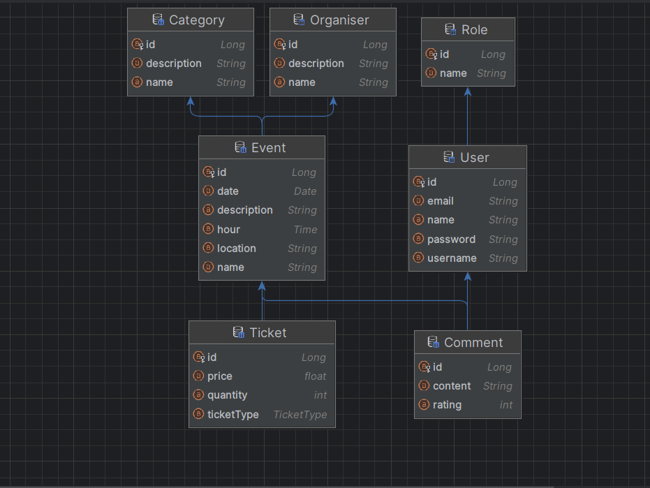

### GatherGrid


> web Jakarta EE based application developped to  enable users to create, promote, manage, and participate in events. This platform provides event organizers with a user-friendly way to plan and promote events, while participants can search for, register for, and interact with various types of events 


 

### Technologies


#### 1. Wildfly as provider (Application Server)
#### 2. MYSQL database
#### 3. Maven Build Tool
#### 4. Servlets
#### 5. JPA / Hibernate
#### 6. JTA (Java Transaction API)
#### 7. Wild SE as implementation of CDI (Context and dependency injection)
#### 8. WildFly Elytron Security Implementation 


### UML DIAGRAM




### STRUCTURE (INITIAL)
```
├───src
│   ├───main
│   │   ├───java
│   │   │   └───ma
│   │   │       └───youcode
│   │   │           └───gathergrid
│   │   │               ├───domain
│   │   │               ├───repositories
│   │   │               ├───resources
│   │   │               ├───service
│   │   │               └───utils
│   │   ├───resources
│   │   │   └───META-INF
│   │   └───webapp
│   │       └───WEB-INF
│   └───test
│       ├───java
│       └───resources
├───target
└───UML
```

